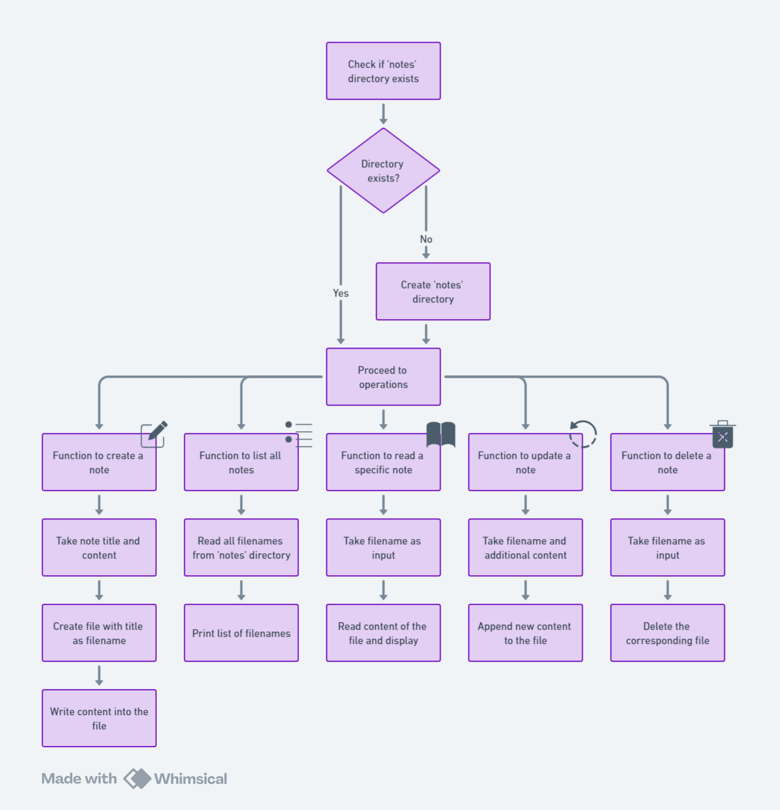

# Simple Note-taking App 📝

Absolutely! Let's dive into a fun exercise that involves multiple aspects of the Node.js FS module. How about building a **simple note-taking app**? In this app, you'll be able to create, read, update, and delete notes, all while practicing file system operations.

## Exercise: Build a Note-Taking App Using the FS Module

### Objectives:
1. **Create a new note**: Add a new text file with a note in it.
2. **Read all notes**: List all notes (i.e., filenames) from a directory.
3. **Read a specific note**: View the content of a particular note.
4. **Update a note**: Modify an existing note by appending new text to it.
5. **Delete a note**: Remove a note from the directory.

### Step-by-Step Breakdown:

1. **Creating a Note**:
   - Use `fs.writeFile()` to create a new file with the note's title as the filename (e.g., `note1.txt`).
   - Write some text content into the file.
   
2. **Reading All Notes**:
   - Use `fs.readdir()` to list all the filenames in the directory where notes are stored.

3. **Reading a Specific Note**:
   - Use `fs.readFile()` to read the content of a note by its filename (e.g., `note1.txt`).

4. **Updating a Note**:
   - Use `fs.appendFile()` to add new content to an existing note file.

5. **Deleting a Note**:
   - Use `fs.unlink()` to delete a note by its filename.

### Hints and Challenges:

- **File and Folder Organization**: 
  - Create a "notes" folder where all notes will be stored. You can use `fs.mkdir()` to ensure the directory exists.

- **Error Handling**: 
  - Be sure to handle errors such as trying to read a non-existent file or trying to delete a note that doesn't exist. You can print user-friendly messages in these cases.

- **Optional Challenge**: 
  - Extend this by creating a simple menu or command-line interface where users can type commands like "add note", "read note", "delete note", etc., and the appropriate function is called.

### Pseudo Code:

Here’s a rough idea of how you could structure the flow of the app:




### Example Interaction (Simulated Command Line)
```
> addNote "ShoppingList" "Buy milk, eggs, and bread"
Note "ShoppingList" created.

> listNotes
Notes:
- ShoppingList

> readNote "ShoppingList"
Content of ShoppingList:
Buy milk, eggs, and bread

> updateNote "ShoppingList" "Also, buy apples."
Note "ShoppingList" updated.

> deleteNote "ShoppingList"
Note "ShoppingList" deleted.
```

---

How does that sound? Would you like to try implementing this, or do you want to break down any specific part of the challenge first?
